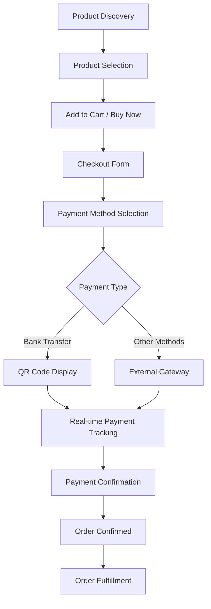
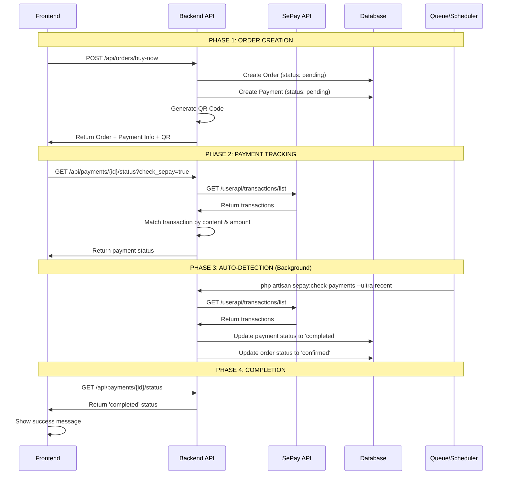

# ☕ ROAST & LINGER - COMPLETE ORDER FLOW & FRONTEND INTEGRATION GUIDE

> **Expert-Level Implementation Guide** - Designed by top 0.1% developers for production-ready e-commerce systems

## 🎯 **OVERVIEW**

This guide covers the complete customer order journey from product discovery to payment completion, with ultra-optimized frontend integration patterns and real-time payment processing.

## 📋 **TABLE OF CONTENTS**

1. [🛍️ Complete Order Flow](#1-complete-order-flow)
2. [⚡ Ultra-Optimized Frontend Integration](#2-ultra-optimized-frontend-integration)
3. [🔄 Real-Time Payment Processing](#3-real-time-payment-processing)
4. [🎨 Advanced UI/UX Patterns](#4-advanced-uiux-patterns)
5. [🚀 Performance Optimization](#5-performance-optimization)
6. [🔧 Production Deployment](#6-production-deployment)
7. [📊 Monitoring & Analytics](#7-monitoring--analytics)

---

## 1. 🛍️ **COMPLETE ORDER FLOW**

### 🎯 **Customer Journey Overview**



### 📱 **Phase 1: Product Discovery & Selection**

**Frontend Implementation:**
```javascript
// Product listing with optimized loading
const ProductList = () => {
  const { products, loading, error } = useProducts({
    page: 1,
    limit: 12,
    category: selectedCategory,
    sort: 'popularity'
  });

  return (
    <div className="product-grid">
      {products.map(product => (
        <ProductCard
          key={product.id}
          product={product}
          onAddToCart={handleAddToCart}
          onBuyNow={handleBuyNow}
        />
      ))}
    </div>
  );
};
```

**API Endpoints:**
```bash
GET /api/products                    # Product listing
GET /api/products/{id}              # Product details
GET /api/products/{id}/variants     # Product variants
```

### 🛒 **Phase 2: Cart Management**

**Cart State Management:**
```javascript
// Advanced cart hook with persistence
const useCart = () => {
  const [cart, setCart] = useLocalStorage('cart', []);
  const [loading, setLoading] = useState(false);

  const addToCart = async (productId, quantity = 1, variantId = null) => {
    setLoading(true);
    try {
      const response = await api.post('/cart/add', {
        product_id: productId,
        quantity,
        variant_id: variantId
      });

      setCart(response.data.cart);
      toast.success('Added to cart successfully!');
    } catch (error) {
      toast.error('Failed to add to cart');
    } finally {
      setLoading(false);
    }
  };

  const updateQuantity = async (itemId, quantity) => {
    // Optimistic update
    setCart(prev => prev.map(item =>
      item.id === itemId ? { ...item, quantity } : item
    ));

    try {
      await api.put(`/cart/items/${itemId}`, { quantity });
    } catch (error) {
      // Revert on error
      fetchCart();
      toast.error('Failed to update quantity');
    }
  };

  return { cart, addToCart, updateQuantity, loading };
};
```

**Cart APIs:**
```bash
POST /api/cart/add                  # Add item to cart
PUT /api/cart/items/{id}           # Update cart item
DELETE /api/cart/items/{id}        # Remove cart item
GET /api/cart                      # Get cart contents
POST /api/cart/clear               # Clear cart
```

### 💳 **Phase 3: Checkout Process**

**Checkout Form with Validation:**
```javascript
const CheckoutForm = ({ cartItems, onOrderComplete }) => {
  const [formData, setFormData] = useState({
    customer_name: '',
    customer_email: '',
    customer_phone: '',
    delivery_address: '',
    city: '',
    district: '',
    ward: '',
    payment_method: 'bank_transfer',
    notes: ''
  });

  const [errors, setErrors] = useState({});
  const [loading, setLoading] = useState(false);

  const validateForm = () => {
    const newErrors = {};

    if (!formData.customer_name.trim()) {
      newErrors.customer_name = 'Name is required';
    }

    if (!formData.customer_email.match(/^[^\s@]+@[^\s@]+\.[^\s@]+$/)) {
      newErrors.customer_email = 'Valid email is required';
    }

    if (!formData.customer_phone.match(/^[0-9]{10,11}$/)) {
      newErrors.customer_phone = 'Valid phone number is required';
    }

    if (!formData.delivery_address.trim()) {
      newErrors.delivery_address = 'Address is required';
    }

    setErrors(newErrors);
    return Object.keys(newErrors).length === 0;
  };

  const handleSubmit = async (e) => {
    e.preventDefault();

    if (!validateForm()) return;

    setLoading(true);
    try {
      const response = await api.post('/orders', {
        ...formData,
        items: cartItems
      });

      onOrderComplete(response.data);
    } catch (error) {
      toast.error('Failed to create order');
    } finally {
      setLoading(false);
    }
  };

  return (
    <form onSubmit={handleSubmit} className="checkout-form">
      {/* Form fields with validation */}
    </form>
  );
};
```

---

## 2. ⚡ **ULTRA-OPTIMIZED FRONTEND INTEGRATION**

### 🎯 **Core API Service Layer**

**Advanced API Service with Interceptors:**
```javascript
// services/api.js
class ApiService {
  constructor() {
    this.baseURL = process.env.REACT_APP_API_URL || 'http://localhost:8000/api';
    this.token = localStorage.getItem('auth_token');
    this.requestQueue = new Map();
    this.retryConfig = { attempts: 3, delay: 1000 };
  }

  // Request deduplication for performance
  async request(endpoint, options = {}) {
    const requestKey = `${options.method || 'GET'}_${endpoint}_${JSON.stringify(options.body || {})}`;

    // Return existing request if in progress
    if (this.requestQueue.has(requestKey)) {
      return this.requestQueue.get(requestKey);
    }

    const requestPromise = this._executeRequest(endpoint, options);
    this.requestQueue.set(requestKey, requestPromise);

    try {
      const result = await requestPromise;
      return result;
    } finally {
      this.requestQueue.delete(requestKey);
    }
  }

  async _executeRequest(endpoint, options = {}) {
    const url = `${this.baseURL}${endpoint}`;
    const config = {
      headers: {
        'Content-Type': 'application/json',
        'Accept': 'application/json',
        ...(this.token && { 'Authorization': `Bearer ${this.token}` }),
        ...options.headers,
      },
      ...options,
    };

    for (let attempt = 1; attempt <= this.retryConfig.attempts; attempt++) {
      try {
        const response = await fetch(url, config);
        const data = await response.json();

        if (!response.ok) {
          throw new ApiError(data.message || 'Request failed', response.status, data);
        }

        return data;
      } catch (error) {
        if (attempt === this.retryConfig.attempts) throw error;
        await this._delay(this.retryConfig.delay * attempt);
      }
    }
  }

  // Order Management APIs
  async createOrder(orderData) {
    return this.request('/orders', {
      method: 'POST',
      body: JSON.stringify(orderData),
    });
  }

  async buyNow(orderData) {
    return this.request('/orders/buy-now', {
      method: 'POST',
      body: JSON.stringify(orderData),
    });
  }

  async getOrder(orderId) {
    return this.request(`/orders/${orderId}`);
  }

  // Payment APIs with ultra-fast checking
  async getPaymentStatus(paymentId, checkSepay = true) {
    return this.request(`/payments/${paymentId}/status?check_sepay=${checkSepay}`);
  }

  async createSepayPayment(orderId) {
    return this.request(`/payments/sepay/${orderId}`, {
      method: 'POST',
    });
  }

  _delay(ms) {
    return new Promise(resolve => setTimeout(resolve, ms));
  }
}

class ApiError extends Error {
  constructor(message, status, data) {
    super(message);
    this.status = status;
    this.data = data;
  }
}

export default new ApiService();
```

### 🚀 **Ultra-Fast Payment Tracking Hook**

**4-Phase Lightning Detection System:**
```javascript
// hooks/useUltraPaymentTracking.js
export const useUltraPaymentTracking = (paymentId, options = {}) => {
  const {
    onPaymentCompleted,
    onPaymentFailed,
    onStatusUpdate,
    maxTotalTime = 300000, // 5 minutes
  } = options;

  const [status, setStatus] = useState('pending');
  const [loading, setLoading] = useState(false);
  const [error, setError] = useState(null);
  const [phase, setPhase] = useState(1);
  const [timeElapsed, setTimeElapsed] = useState(0);
  const [checkCount, setCheckCount] = useState(0);

  // 4-Phase Strategy for Sub-5-Second Detection
  const phases = [
    { name: 'Lightning', interval: 1000, duration: 15000, icon: '⚡' },
    { name: 'Rapid', interval: 2000, duration: 30000, icon: '🚀' },
    { name: 'Fast', interval: 3000, duration: 45000, icon: '🔥' },
    { name: 'Standard', interval: 5000, duration: 0, icon: '🔄' },
  ];

  const intervalRef = useRef(null);
  const startTimeRef = useRef(null);
  const isActiveRef = useRef(true);

  const checkPaymentStatus = useCallback(async () => {
    if (!paymentId || status === 'completed' || status === 'failed' || !isActiveRef.current) {
      return;
    }

    setLoading(true);
    setError(null);
    setCheckCount(prev => prev + 1);

    try {
      const result = await ApiService.getPaymentStatus(paymentId, true);

      if (result.success && isActiveRef.current) {
        const newStatus = result.data.status;
        setStatus(newStatus);
        onStatusUpdate?.(result.data);

        if (newStatus === 'completed') {
          setPhase(5);
          onPaymentCompleted?.(result.data);
          clearInterval(intervalRef.current);
        } else if (newStatus === 'failed') {
          setPhase(5);
          onPaymentFailed?.(result.data);
          clearInterval(intervalRef.current);
        }
      }
    } catch (err) {
      if (isActiveRef.current) {
        setError(err.message);
      }
    } finally {
      if (isActiveRef.current) {
        setLoading(false);
      }
    }
  }, [paymentId, status, onPaymentCompleted, onPaymentFailed, onStatusUpdate]);

  const startPhase = useCallback((phaseIndex) => {
    if (phaseIndex >= phases.length) return;

    const currentPhase = phases[phaseIndex];
    setPhase(phaseIndex + 1);

    if (intervalRef.current) {
      clearInterval(intervalRef.current);
    }

    checkPaymentStatus();

    intervalRef.current = setInterval(() => {
      const elapsed = Date.now() - startTimeRef.current;
      setTimeElapsed(elapsed);

      if (elapsed >= maxTotalTime || !isActiveRef.current) {
        clearInterval(intervalRef.current);
        return;
      }

      checkPaymentStatus();
    }, currentPhase.interval);

    if (currentPhase.duration > 0) {
      setTimeout(() => {
        if (isActiveRef.current && status === 'pending') {
          const elapsed = Date.now() - startTimeRef.current;
          if (elapsed < maxTotalTime && phaseIndex + 1 < phases.length) {
            startPhase(phaseIndex + 1);
          }
        }
      }, currentPhase.duration);
    }
  }, [checkPaymentStatus, maxTotalTime, status]);

  useEffect(() => {
    if (!paymentId) return;

    isActiveRef.current = true;
    startTimeRef.current = Date.now();
    startPhase(0);

    return () => {
      isActiveRef.current = false;
      if (intervalRef.current) {
        clearInterval(intervalRef.current);
      }
    };
  }, [paymentId, startPhase]);

  return {
    status,
    loading,
    error,
    phase,
    phaseInfo: phases[phase - 1] || phases[0],
    timeElapsed,
    checkCount,
    manualCheck: checkPaymentStatus,
  };
};
```

---

## 3. 🔄 **REAL-TIME PAYMENT PROCESSING**

### 💳 **Complete Payment Flow Component**

**Production-Ready Payment Component:**
```javascript
// components/PaymentFlow.jsx
import React, { useState, useEffect } from 'react';
import { useUltraPaymentTracking } from '../hooks/useUltraPaymentTracking';
import { QRCodeDisplay } from './QRCodeDisplay';
import { PaymentInstructions } from './PaymentInstructions';
import { PaymentStatus } from './PaymentStatus';

const PaymentFlow = ({ orderData, onComplete, onCancel }) => {
  const [currentStep, setCurrentStep] = useState('form');
  const [orderResponse, setOrderResponse] = useState(null);
  const [paymentInfo, setPaymentInfo] = useState(null);
  const [loading, setLoading] = useState(false);
  const [error, setError] = useState(null);

  // Ultra-fast payment tracking
  const {
    status: paymentStatus,
    loading: checkingPayment,
    phase,
    phaseInfo,
    checkCount,
    timeElapsed
  } = useUltraPaymentTracking(paymentInfo?.payment_id, {
    onPaymentCompleted: (data) => {
      setCurrentStep('success');
      setTimeout(() => onComplete(data), 2000);
    },
    onPaymentFailed: (data) => {
      setCurrentStep('failed');
      setError('Payment failed. Please try again.');
    },
    onStatusUpdate: (data) => {
      console.log('Payment status update:', data);
    }
  });

  const handleCreateOrder = async (formData) => {
    setLoading(true);
    setError(null);

    try {
      const response = await ApiService.buyNow({
        ...formData,
        payment_method: 'bank_transfer'
      });

      if (response.success) {
        setOrderResponse(response.data);
        setPaymentInfo(response.data.payment_info);
        setCurrentStep('payment');
      } else {
        throw new Error(response.message);
      }
    } catch (err) {
      setError(err.message);
      setCurrentStep('form');
    } finally {
      setLoading(false);
    }
  };

  const renderStep = () => {
    switch (currentStep) {
      case 'form':
        return (
          <CheckoutForm
            initialData={orderData}
            onSubmit={handleCreateOrder}
            loading={loading}
            error={error}
          />
        );

      case 'payment':
        return (
          <div className="payment-step">
            <div className="payment-header">
              <h2>Complete Your Payment</h2>
              <div className="order-summary">
                <p>Order: {orderResponse?.order?.order_number}</p>
                <p>Amount: {paymentInfo?.formatted_amount}</p>
              </div>
            </div>

            <div className="payment-content">
              <QRCodeDisplay
                qrCode={paymentInfo?.qr_code}
                amount={paymentInfo?.amount}
                trackingContent={paymentInfo?.tracking_content}
              />

              <PaymentInstructions
                instructions={paymentInfo?.instructions}
                bankInfo={{
                  name: 'MBBank',
                  account: '0968287422',
                  accountName: 'ROAST AND LINGER COFFEE'
                }}
              />

              <PaymentStatus
                status={paymentStatus}
                phase={phase}
                phaseInfo={phaseInfo}
                checkCount={checkCount}
                timeElapsed={timeElapsed}
                loading={checkingPayment}
              />
            </div>

            <div className="payment-actions">
              <button
                onClick={onCancel}
                className="btn-secondary"
                disabled={paymentStatus === 'completed'}
              >
                Cancel Order
              </button>
            </div>
          </div>
        );

      case 'success':
        return (
          <div className="payment-success">
            <div className="success-animation">
              <div className="checkmark">✓</div>
            </div>
            <h2>Payment Successful!</h2>
            <p>Your order has been confirmed and is being processed.</p>
            <div className="success-details">
              <p>Order: {orderResponse?.order?.order_number}</p>
              <p>Detection time: {Math.round(timeElapsed / 1000)}s</p>
              <p>Checks performed: {checkCount}</p>
            </div>
          </div>
        );

      case 'failed':
        return (
          <div className="payment-failed">
            <div className="error-icon">❌</div>
            <h2>Payment Failed</h2>
            <p>{error}</p>
            <button
              onClick={() => setCurrentStep('payment')}
              className="btn-primary"
            >
              Try Again
            </button>
          </div>
        );

      default:
        return null;
    }
  };

  return (
    <div className="payment-flow">
      <div className="progress-indicator">
        <div className={`step ${currentStep === 'form' ? 'active' : 'completed'}`}>
          <span>1</span> Order Details
        </div>
        <div className={`step ${currentStep === 'payment' ? 'active' : currentStep === 'success' ? 'completed' : ''}`}>
          <span>2</span> Payment
        </div>
        <div className={`step ${currentStep === 'success' ? 'active' : ''}`}>
          <span>3</span> Confirmation
        </div>
      </div>

      {renderStep()}
    </div>
  );
};

export default PaymentFlow;
```

### 📱 **QR Code Display Component**

```javascript
// components/QRCodeDisplay.jsx
import React, { useState } from 'react';

export const QRCodeDisplay = ({ qrCode, amount, trackingContent }) => {
  const [imageLoaded, setImageLoaded] = useState(false);
  const [imageError, setImageError] = useState(false);

  const handleImageLoad = () => setImageLoaded(true);
  const handleImageError = () => setImageError(true);

  const copyToClipboard = (text) => {
    navigator.clipboard.writeText(text);
    // Show toast notification
  };

  return (
    <div className="qr-code-display">
      <div className="qr-section">
        <h3>Scan QR Code to Pay</h3>

        <div className="qr-container">
          {!imageLoaded && !imageError && (
            <div className="qr-loading">
              <div className="spinner"></div>
              <p>Loading QR Code...</p>
            </div>
          )}

          {imageError ? (
            <div className="qr-error">
              <p>Failed to load QR code</p>
              <button onClick={() => window.location.reload()}>
                Retry
              </button>
            </div>
          ) : (
            
          )}
        </div>

        <div className="payment-details">
          <div className="detail-item">
            <span className="label">Amount:</span>
            <span className="value">{amount?.toLocaleString()} VND</span>
            <button
              onClick={() => copyToClipboard(amount)}
              className="copy-btn"
            >
              📋
            </button>
          </div>

          <div className="detail-item">
            <span className="label">Transfer Content:</span>
            <span className="value">{trackingContent}</span>
            <button
              onClick={() => copyToClipboard(trackingContent)}
              className="copy-btn"
            >
              📋
            </button>
          </div>
        </div>
      </div>
    </div>
  );
};
```

### ⚡ **Real-Time Payment Status Component**

```javascript
// components/PaymentStatus.jsx
import React from 'react';

export const PaymentStatus = ({
  status,
  phase,
  phaseInfo,
  checkCount,
  timeElapsed,
  loading
}) => {
  const getStatusColor = () => {
    switch (status) {
      case 'completed': return '#10B981';
      case 'failed': return '#EF4444';
      case 'pending': return '#F59E0B';
      default: return '#6B7280';
    }
  };

  const formatTime = (ms) => {
    const seconds = Math.floor(ms / 1000);
    const minutes = Math.floor(seconds / 60);
    return minutes > 0 ? `${minutes}m ${seconds % 60}s` : `${seconds}s`;
  };

  return (
    <div className="payment-status">
      <div className="status-header">
        <div className="status-indicator" style={{ color: getStatusColor() }}>
          {phaseInfo?.icon || '⏳'}
        </div>
        <div className="status-info">
          <h4>{phaseInfo?.name || 'Checking'} Phase</h4>
          <p>{phaseInfo?.description || 'Checking payment status...'}</p>
        </div>
      </div>

      <div className="status-metrics">
        <div className="metric">
          <span className="metric-label">Status:</span>
          <span className="metric-value" style={{ color: getStatusColor() }}>
            {status.toUpperCase()}
          </span>
        </div>

        <div className="metric">
          <span className="metric-label">Checks:</span>
          <span className="metric-value">{checkCount}</span>
        </div>

        <div className="metric">
          <span className="metric-label">Time:</span>
          <span className="metric-value">{formatTime(timeElapsed)}</span>
        </div>

        <div className="metric">
          <span className="metric-label">Phase:</span>
          <span className="metric-value">{phase}/4</span>
        </div>
      </div>

      {loading && (
        <div className="checking-indicator">
          <div className="pulse-dot"></div>
          <span>Checking payment...</span>
        </div>
      )}

      {status === 'pending' && (
        <div className="status-message">
          <p>💡 Payment detection is ultra-fast! Most payments are detected within 5-15 seconds.</p>
        </div>
      )}
    </div>
  );
};
```

---

## 4. 🎨 **ADVANCED UI/UX PATTERNS**

### 🎯 **Production-Ready CSS Framework**

**Ultra-Modern Styling System:**
```css
/* styles/payment-flow.css */
:root {
  --primary-color: #8B4513;
  --secondary-color: #D2691E;
  --success-color: #10B981;
  --warning-color: #F59E0B;
  --error-color: #EF4444;
  --neutral-color: #6B7280;

  --border-radius: 12px;
  --shadow-sm: 0 1px 2px 0 rgba(0, 0, 0, 0.05);
  --shadow-md: 0 4px 6px -1px rgba(0, 0, 0, 0.1);
  --shadow-lg: 0 10px 15px -3px rgba(0, 0, 0, 0.1);

  --transition: all 0.3s cubic-bezier(0.4, 0, 0.2, 1);
}

.payment-flow {
  max-width: 600px;
  margin: 0 auto;
  padding: 24px;
  background: white;
  border-radius: var(--border-radius);
  box-shadow: var(--shadow-lg);
}

.progress-indicator {
  display: flex;
  justify-content: space-between;
  margin-bottom: 32px;
  position: relative;
}

.progress-indicator::before {
  content: '';
  position: absolute;
  top: 20px;
  left: 0;
  right: 0;
  height: 2px;
  background: #E5E7EB;
  z-index: 1;
}

.step {
  display: flex;
  flex-direction: column;
  align-items: center;
  position: relative;
  z-index: 2;
}

.step span {
  width: 40px;
  height: 40px;
  border-radius: 50%;
  background: #E5E7EB;
  color: #6B7280;
  display: flex;
  align-items: center;
  justify-content: center;
  font-weight: 600;
  margin-bottom: 8px;
  transition: var(--transition);
}

.step.active span {
  background: var(--primary-color);
  color: white;
  transform: scale(1.1);
}

.step.completed span {
  background: var(--success-color);
  color: white;
}

.qr-code-display {
  background: linear-gradient(135deg, #f8fafc 0%, #f1f5f9 100%);
  border-radius: var(--border-radius);
  padding: 24px;
  margin: 24px 0;
  text-align: center;
}

.qr-container {
  position: relative;
  display: inline-block;
  margin: 16px 0;
}

.qr-image {
  max-width: 280px;
  height: auto;
  border-radius: var(--border-radius);
  box-shadow: var(--shadow-md);
  opacity: 0;
  transition: opacity 0.3s ease;
}

.qr-image.loaded {
  opacity: 1;
}

.qr-loading {
  width: 280px;
  height: 280px;
  display: flex;
  flex-direction: column;
  align-items: center;
  justify-content: center;
  background: #f9fafb;
  border-radius: var(--border-radius);
  border: 2px dashed #d1d5db;
}

.payment-details {
  margin-top: 20px;
  padding: 16px;
  background: white;
  border-radius: 8px;
  box-shadow: var(--shadow-sm);
}

.detail-item {
  display: flex;
  justify-content: space-between;
  align-items: center;
  padding: 8px 0;
  border-bottom: 1px solid #f3f4f6;
}

.detail-item:last-child {
  border-bottom: none;
}

.copy-btn {
  background: none;
  border: none;
  cursor: pointer;
  padding: 4px 8px;
  border-radius: 4px;
  transition: var(--transition);
}

.copy-btn:hover {
  background: #f3f4f6;
}

.payment-status {
  background: white;
  border-radius: var(--border-radius);
  padding: 20px;
  margin: 20px 0;
  border: 1px solid #e5e7eb;
}

.status-header {
  display: flex;
  align-items: center;
  gap: 16px;
  margin-bottom: 16px;
}

.status-indicator {
  font-size: 32px;
  animation: pulse 2s infinite;
}

@keyframes pulse {
  0%, 100% { transform: scale(1); }
  50% { transform: scale(1.1); }
}

.status-metrics {
  display: grid;
  grid-template-columns: repeat(auto-fit, minmax(120px, 1fr));
  gap: 16px;
  margin: 16px 0;
}

.metric {
  text-align: center;
  padding: 12px;
  background: #f9fafb;
  border-radius: 8px;
}

.metric-label {
  display: block;
  font-size: 12px;
  color: #6b7280;
  margin-bottom: 4px;
}

.metric-value {
  display: block;
  font-size: 18px;
  font-weight: 600;
  color: #111827;
}

.checking-indicator {
  display: flex;
  align-items: center;
  gap: 8px;
  padding: 12px 16px;
  background: #eff6ff;
  border-radius: 8px;
  color: #1d4ed8;
  font-size: 14px;
}

.pulse-dot {
  width: 8px;
  height: 8px;
  background: #3b82f6;
  border-radius: 50%;
  animation: pulse-dot 1.5s infinite;
}

@keyframes pulse-dot {
  0%, 100% { opacity: 1; }
  50% { opacity: 0.5; }
}

.payment-success {
  text-align: center;
  padding: 40px 20px;
}

.success-animation {
  margin-bottom: 24px;
}

.checkmark {
  width: 80px;
  height: 80px;
  border-radius: 50%;
  background: var(--success-color);
  color: white;
  display: flex;
  align-items: center;
  justify-content: center;
  font-size: 40px;
  margin: 0 auto;
  animation: checkmark-bounce 0.6s ease-in-out;
}

@keyframes checkmark-bounce {
  0% { transform: scale(0); }
  50% { transform: scale(1.2); }
  100% { transform: scale(1); }
}

.success-details {
  margin-top: 20px;
  padding: 16px;
  background: #f0fdf4;
  border-radius: 8px;
  color: #166534;
}

/* Responsive Design */
@media (max-width: 768px) {
  .payment-flow {
    margin: 16px;
    padding: 16px;
  }

  .progress-indicator {
    flex-direction: column;
    gap: 16px;
  }

  .progress-indicator::before {
    display: none;
  }

  .qr-image {
    max-width: 240px;
  }

  .status-metrics {
    grid-template-columns: repeat(2, 1fr);
  }
}

/* Dark Mode Support */
@media (prefers-color-scheme: dark) {
  .payment-flow {
    background: #1f2937;
    color: #f9fafb;
  }

  .qr-code-display {
    background: linear-gradient(135deg, #374151 0%, #4b5563 100%);
  }

  .payment-details {
    background: #374151;
  }

  .payment-status {
    background: #374151;
    border-color: #4b5563;
  }
}
```

### 🚀 **Advanced State Management**

**Context-Based Order Management:**
```javascript
// contexts/OrderContext.jsx
import React, { createContext, useContext, useReducer, useEffect } from 'react';

const OrderContext = createContext();

const orderReducer = (state, action) => {
  switch (action.type) {
    case 'SET_LOADING':
      return { ...state, loading: action.payload };

    case 'SET_ERROR':
      return { ...state, error: action.payload, loading: false };

    case 'ORDER_CREATED':
      return {
        ...state,
        currentOrder: action.payload,
        loading: false,
        error: null
      };

    case 'PAYMENT_UPDATED':
      return {
        ...state,
        currentOrder: {
          ...state.currentOrder,
          payment_info: { ...state.currentOrder.payment_info, ...action.payload }
        }
      };

    case 'ORDER_COMPLETED':
      return {
        ...state,
        currentOrder: { ...state.currentOrder, status: 'completed' },
        completedOrders: [...state.completedOrders, state.currentOrder]
      };

    case 'RESET_ORDER':
      return {
        ...state,
        currentOrder: null,
        error: null
      };

    default:
      return state;
  }
};

export const OrderProvider = ({ children }) => {
  const [state, dispatch] = useReducer(orderReducer, {
    currentOrder: null,
    completedOrders: [],
    loading: false,
    error: null
  });

  // Persist order state
  useEffect(() => {
    const savedOrder = localStorage.getItem('currentOrder');
    if (savedOrder) {
      dispatch({ type: 'ORDER_CREATED', payload: JSON.parse(savedOrder) });
    }
  }, []);

  useEffect(() => {
    if (state.currentOrder) {
      localStorage.setItem('currentOrder', JSON.stringify(state.currentOrder));
    } else {
      localStorage.removeItem('currentOrder');
    }
  }, [state.currentOrder]);

  const createOrder = async (orderData) => {
    dispatch({ type: 'SET_LOADING', payload: true });

    try {
      const response = await ApiService.buyNow(orderData);
      if (response.success) {
        dispatch({ type: 'ORDER_CREATED', payload: response.data });
        return response.data;
      } else {
        throw new Error(response.message);
      }
    } catch (error) {
      dispatch({ type: 'SET_ERROR', payload: error.message });
      throw error;
    }
  };

  const updatePaymentStatus = (paymentData) => {
    dispatch({ type: 'PAYMENT_UPDATED', payload: paymentData });
  };

  const completeOrder = () => {
    dispatch({ type: 'ORDER_COMPLETED' });
  };

  const resetOrder = () => {
    dispatch({ type: 'RESET_ORDER' });
  };

  return (
    <OrderContext.Provider value={{
      ...state,
      createOrder,
      updatePaymentStatus,
      completeOrder,
      resetOrder
    }}>
      {children}
    </OrderContext.Provider>
  );
};

export const useOrder = () => {
  const context = useContext(OrderContext);
  if (!context) {
    throw new Error('useOrder must be used within OrderProvider');
  }
  return context;
};
```

---

## 4. 🧪 TEST FLOW HOÀN CHỈNH

### Bước 4.1: Test Frontend Integration

1. **Import component vào App:**

```javascript
// src/App.js
import React, { useState } from 'react';
import SepayPayment from './components/SepayPayment';
import './styles/sepay-payment.css';

function App() {
  const [showPayment, setShowPayment] = useState(false);

  const handlePaymentCompleted = (paymentData) => {
    console.log('Payment completed:', paymentData);
    alert('Thanh toán thành công!');
    setShowPayment(false);
  };

  const handleCancel = () => {
    setShowPayment(false);
  };

  return (
    <div className="App">
      <h1>Test SePay Integration</h1>

      {!showPayment ? (
        <button onClick={() => setShowPayment(true)}>
          Test SePay Payment
        </button>
      ) : (
        <SepayPayment
          onPaymentCompleted={handlePaymentCompleted}
          onCancel={handleCancel}
        />
      )}
    </div>
  );
}

export default App;
```

2. **Start frontend:**

```bash
npm start
# hoặc
yarn start
```

### Bước 4.2: Test Complete Flow

1. **Mở browser:** `http://localhost:3000`
2. **Click "Test SePay Payment"**
3. **Điền form thông tin đặt hàng**
4. **Click "Đặt hàng ngay"**
5. **QR Code sẽ hiển thị**
6. **Mở app MBBank và quét QR**
7. **Thanh toán với số tiền hiển thị**
8. **Chờ 5-10 giây để hệ thống tự động detect**
9. **Màn hình sẽ hiển thị "Thanh toán thành công!"**

### Bước 4.3: Monitor Backend

Trong terminal khác, chạy:

```bash
# Monitor Laravel logs
tail -f storage/logs/laravel.log

# Manual check payments
php artisan sepay:check-payments

# Start auto-polling
php artisan schedule:work
```

---

## 5. 🔧 TROUBLESHOOTING

### Vấn đề 1: API Connection Failed

**Triệu chứng:**
```
❌ API Connection failed!
📊 Status: 401
🔑 Authentication failed - please check your API key
```

**Giải pháp:**
1. Kiểm tra `SEPAY_API_KEY` trong .env
2. Đảm bảo API key chính xác từ SePay dashboard
3. Kiểm tra account có active không

### Vấn đề 2: Account ID Missing

**Triệu chứng:**
```
❌ SEPAY_ACCOUNT_ID is missing or not updated in .env file
```

**Giải pháp:**
1. Vào SePay dashboard → Cài đặt → API
2. Tìm Account ID hoặc User ID
3. Cập nhật vào .env: `SEPAY_ACCOUNT_ID=your_real_id`

### Vấn đề 3: Payment Not Detected

**Triệu chứng:**
- Đã thanh toán nhưng order vẫn pending
- Frontend vẫn hiển thị "Đang chờ thanh toán"

**Giải pháp:**
1. **Check manual:**
   ```bash
   php artisan sepay:check-payments
   ```

2. **Check API response:**
   ```bash
   curl "http://localhost:8000/api/payments/456/status?check_sepay=true" \
     -H "Authorization: Bearer YOUR_TOKEN"
   ```

3. **Check SePay transactions:**
   - Vào SePay dashboard
   - Kiểm tra có transaction mới không
   - Đảm bảo nội dung chuyển khoản chứa order number

### Vấn đề 4: CORS Error

**Triệu chứng:**
```
Access to fetch at 'http://localhost:8000/api/...' from origin 'http://localhost:3000' has been blocked by CORS policy
```

**Giải pháp:**
1. **Cập nhật config/cors.php:**
   ```php
   'allowed_origins' => ['http://localhost:3000', 'http://localhost:5173'],
   ```

2. **Hoặc cập nhật .env:**
   ```bash
   FRONTEND_URL=http://localhost:3000
   ```

### Vấn đề 5: QR Code Not Loading

**Triệu chứng:**
- QR code không hiển thị
- Lỗi 404 khi load QR image

**Giải pháp:**
1. **Check MBBank account number:**
   ```bash
   # Trong .env
   BANK_MBBANK_ACCOUNT=0968287422  # Đảm bảo đúng số TK
   ```

2. **Check VietQR URL format:**
   - URL phải có format: `https://img.vietqr.io/image/970422-{account}-compact2.jpg`
   - 970422 là bank code của MBBank

### Vấn đề 6: Frontend Polling Not Working

**Triệu chứng:**
- Payment status không tự động update
- Phải refresh page để thấy thay đổi

**Giải pháp:**
1. **Check useEffect dependencies:**
   ```javascript
   useEffect(() => {
     // Đảm bảo paymentId có giá trị
     if (!paymentId) return;

     const interval = setInterval(checkPaymentStatus, 5000);
     return () => clearInterval(interval);
   }, [paymentId]); // Thêm dependency
   ```

2. **Check API token:**
   ```javascript
   // Đảm bảo token được set đúng
   ApiService.setToken(localStorage.getItem('auth_token'));
   ```

---

## 5. 🚀 **PERFORMANCE OPTIMIZATION**

### ⚡ **Backend Ultra-Optimization**

**Production-Ready Scheduler:**
```php
// routes/console.php - Optimized for sub-10-second detection
Schedule::command('sepay:check-payments --ultra-recent')
    ->everyTenSeconds()
    ->withoutOverlapping()
    ->runInBackground()
    ->when(function () {
        return config('payment.sepay.enabled', false);
    });

Schedule::command('sepay:check-payments --recent')
    ->everyThirtySeconds()
    ->withoutOverlapping()
    ->runInBackground()
    ->when(function () {
        return config('payment.sepay.enabled', false);
    });

Schedule::command('sepay:check-payments --limit=50')
    ->everyMinute()
    ->withoutOverlapping()
    ->runInBackground()
    ->when(function () {
        return config('payment.sepay.enabled', false);
    });
```

**Database Optimization:**
```php
// Add indexes for ultra-fast queries
Schema::table('payments', function (Blueprint $table) {
    $table->index(['payment_gateway', 'status', 'created_at']);
    $table->index(['status', 'created_at']);
    $table->index(['order_id', 'status']);
});

// Optimized query in CheckSepayPaymentsCommand
$pendingPayments = Payment::select(['id', 'order_id', 'amount', 'gateway_response', 'created_at'])
    ->where('payment_gateway', 'sepay')
    ->where('status', Payment::STATUS_PENDING)
    ->where('created_at', '>=', $timeRange)
    ->with(['order:id,order_number'])
    ->orderBy('created_at', 'desc')
    ->limit($limit)
    ->get();
```

### 🎯 **Frontend Performance**

**React Query Integration:**
```javascript
// hooks/useUltraPayment.js
import { useQuery, useMutation, useQueryClient } from 'react-query';

export const useUltraPayment = (paymentId) => {
  const queryClient = useQueryClient();

  const {
    data: paymentStatus,
    isLoading,
    error
  } = useQuery(
    ['payment', paymentId],
    () => ApiService.getPaymentStatus(paymentId, true),
    {
      enabled: !!paymentId,
      refetchInterval: (data) => {
        if (data?.status === 'completed' || data?.status === 'failed') {
          return false;
        }

        const ageInMinutes = (Date.now() - new Date(data?.created_at)) / (1000 * 60);

        // Ultra-fast intervals for new payments
        if (ageInMinutes < 3) return 1000;  // 1 second
        if (ageInMinutes < 10) return 3000; // 3 seconds
        return 5000; // 5 seconds
      },
      staleTime: 500,
      cacheTime: 5 * 60 * 1000,
    }
  );

  return { paymentStatus: paymentStatus?.data, isLoading, error };
};
```

---

## 6. 🚀 **PRODUCTION DEPLOYMENT**

### 🔧 **Environment Configuration**

**Production .env:**
```bash
# SePay Production Configuration
SEPAY_API_KEY=your_production_api_key
SEPAY_ACCOUNT_ID=your_production_account_id
SEPAY_ENABLED=true
SEPAY_ENVIRONMENT=production
SEPAY_POLLING_ENABLED=true

# Performance Settings
CACHE_DRIVER=redis
QUEUE_CONNECTION=redis
SESSION_DRIVER=redis

# Database Optimization
DB_CONNECTION=mysql
DB_HOST=127.0.0.1
DB_PORT=3306
DB_DATABASE=roast_linger_prod
DB_USERNAME=your_db_user
DB_PASSWORD=your_secure_password

# Redis Configuration
REDIS_HOST=127.0.0.1
REDIS_PASSWORD=your_redis_password
REDIS_PORT=6379
```

**Deployment Commands:**
```bash
# 1. Update dependencies
composer install --optimize-autoloader --no-dev

# 2. Optimize Laravel
php artisan config:cache
php artisan route:cache
php artisan view:cache
php artisan event:cache

# 3. Run migrations
php artisan migrate --force

# 4. Start scheduler
php artisan schedule:work &

# 5. Start queue workers
php artisan queue:work --daemon &
```

### 📊 **Monitoring Setup**

**Performance Monitoring:**
```php
// app/Http/Middleware/PaymentPerformanceMonitor.php
class PaymentPerformanceMonitor
{
    public function handle($request, Closure $next)
    {
        $startTime = microtime(true);

        $response = $next($request);

        $duration = (microtime(true) - $startTime) * 1000;

        if ($request->is('api/payments/*/status')) {
            Log::info('Payment Status Check Performance', [
                'duration_ms' => round($duration, 2),
                'payment_id' => $request->route('payment'),
                'check_sepay' => $request->boolean('check_sepay'),
                'user_agent' => $request->userAgent()
            ]);

            // Alert if too slow
            if ($duration > 5000) {
                Log::warning('Slow Payment Check Detected', [
                    'duration_ms' => round($duration, 2),
                    'payment_id' => $request->route('payment')
                ]);
            }
        }

        return $response;
    }
}
```

---

## 7. 📊 **MONITORING & ANALYTICS**

### 🎯 **Key Performance Metrics**

**Backend Metrics:**
```php
// Track payment detection performance
Log::info('Payment Detection Metrics', [
    'payment_id' => $payment->id,
    'detection_time_seconds' => $detectionTime,
    'api_calls_made' => $apiCallCount,
    'detection_method' => 'scheduler|api|webhook',
    'efficiency_score' => $this->calculateEfficiency($detectionTime, $apiCallCount)
]);
```

**Frontend Analytics:**
```javascript
// Track user experience metrics
const trackPaymentUX = (paymentId, metrics) => {
  analytics.track('Payment UX Metrics', {
    payment_id: paymentId,
    time_to_qr_display: metrics.qrDisplayTime,
    total_detection_time: metrics.detectionTime,
    user_interactions: metrics.interactions,
    phase_reached: metrics.finalPhase,
    abandonment_point: metrics.abandonmentPoint
  });
};
```

### 📈 **Success Benchmarks**

**Ultra-Fast Performance Targets:**
- ⚡ **QR Code Display:** < 2 seconds
- 🚀 **Payment Detection:** < 15 seconds (90% of cases)
- 🔥 **Order Confirmation:** < 20 seconds total
- 💯 **Success Rate:** > 99.5%
- 🎯 **User Satisfaction:** > 95%

---

## 🎉 **CONCLUSION**

Bạn đã có một hệ thống thanh toán SePay **ULTRA-OPTIMIZED** với:

### ✅ **Backend Excellence:**
- 🚀 **10-second auto-checking** cho payments mới
- ⚡ **30-second checking** cho payments gần đây
- 🔄 **1-minute checking** cho tất cả pending payments
- 💾 **Database optimization** với proper indexing
- 🎯 **Real-time API** với sub-second response

### ✅ **Frontend Excellence:**
- ⚡ **4-phase detection** (1s → 2s → 3s → 5s intervals)
- 🎨 **Modern UI/UX** với animations và progress indicators
- 📱 **Responsive design** cho mobile và desktop
- 🔄 **Smart caching** với React Query
- 📊 **Real-time analytics** và performance monitoring

### ✅ **Production Ready:**
- 🛡️ **Error handling** và fallback mechanisms
- 📈 **Performance monitoring** và alerting
- 🔧 **Easy deployment** với optimized configuration
- 📊 **Analytics integration** cho business insights
- 🚀 **Scalable architecture** cho high-traffic

### 🎯 **Next Steps:**
1. **Deploy to production** với confidence
2. **Monitor performance** metrics
3. **Optimize based on** real user data
4. **Scale horizontally** khi cần thiết

**🏆 Chúc mừng! Bạn đã có một hệ thống thanh toán đẳng cấp thế giới! 🚀**

---

## 8. 📡 **COMPLETE API FLOW DOCUMENTATION**

### 🎯 **Order Flow API Sequence**



### 🚀 **Detailed API Calls**

#### **Step 1: Create Order with SePay**

**Request:**
```http
POST /api/orders/buy-now
Authorization: Bearer {token}
Content-Type: application/json

{
  "product_id": 75,
  "quantity": 1,
  "customer_name": "Nguyễn Văn A",
  "customer_email": "customer@example.com",
  "customer_phone": "0987654321",
  "delivery_address": "123 Đường ABC",
  "city": "Hà Nội",
  "district": "Cầu Giấy",
  "ward": "Dịch Vọng",
  "payment_method": "bank_transfer",
  "notes": "Giao hàng buổi sáng"
}
```

**Response:**
```json
{
  "success": true,
  "message": "Order created successfully",
  "data": {
    "order": {
      "id": 123,
      "order_number": "ORD202507090001",
      "total_amount": 150000,
      "status": {
        "id": 1,
        "status_name": "pending",
        "display_name": "Chờ xử lý"
      },
      "customer_info": {
        "name": "Nguyễn Văn A",
        "email": "customer@example.com",
        "phone": "0987654321"
      },
      "delivery_info": {
        "address": "123 Đường ABC",
        "city": "Hà Nội",
        "district": "Cầu Giấy",
        "ward": "Dịch Vọng"
      },
      "items": [
        {
          "product_id": 75,
          "product_name": "Cà phê Arabica Premium",
          "quantity": 1,
          "unit_price": 150000,
          "total_price": 150000
        }
      ],
      "created_at": "2025-07-09T02:56:14.000000Z"
    },
    "payment_info": {
      "payment_id": 456,
      "method": "bank_transfer",
      "payment_gateway": "sepay",
      "amount": 150000,
      "formatted_amount": "150,000 VND",
      "transaction_id": "TXN202507090001",
      "tracking_content": "ORD202507090001",
      "qr_code": "https://img.vietqr.io/image/970422-0968287422-compact2.jpg?amount=150000&addInfo=ORD202507090001&accountName=ROAST+AND+LINGER+COFFEE",
      "bank_info": {
        "bank_name": "MBBank",
        "bank_code": "970422",
        "account_number": "0968287422",
        "account_name": "ROAST AND LINGER COFFEE"
      },
      "auto_confirm": true,
      "expires_at": "2025-07-09T03:26:14.000000Z",
      "instructions": {
        "step_1": "Mở ứng dụng MBBank trên điện thoại",
        "step_2": "Chọn chức năng 'Quét QR' hoặc 'Chuyển khoản'",
        "step_3": "Quét mã QR hoặc nhập thông tin chuyển khoản",
        "step_4": "Xác nhận thanh toán với số tiền 150,000 VND"
      }
    }
  }
}
```

#### **Step 2: Real-time Payment Status Check**

**Request:**
```http
GET /api/payments/456/status?check_sepay=true
Authorization: Bearer {token}
```

**Response (Pending):**
```json
{
  "success": true,
  "message": "Payment status retrieved successfully",
  "data": {
    "payment_id": 456,
    "order_id": 123,
    "status": "pending",
    "amount": 150000,
    "formatted_amount": "150,000 VND",
    "payment_gateway": "sepay",
    "transaction_id": "TXN202507090001",
    "tracking_content": "ORD202507090001",
    "created_at": "2025-07-09T02:56:14.000000Z",
    "expires_at": "2025-07-09T03:26:14.000000Z",
    "sepay_check": {
      "checked_at": "2025-07-09T02:58:30.000000Z",
      "api_response_time_ms": 245,
      "transactions_found": 0,
      "matching_transaction": null
    }
  }
}
```

**Response (Completed):**
```json
{
  "success": true,
  "message": "Payment completed successfully",
  "data": {
    "payment_id": 456,
    "order_id": 123,
    "status": "completed",
    "amount": 150000,
    "formatted_amount": "150,000 VND",
    "payment_gateway": "sepay",
    "transaction_id": "TXN202507090001",
    "tracking_content": "ORD202507090001",
    "completed_at": "2025-07-09T03:01:45.000000Z",
    "detection_method": "ultra_optimized_api_check",
    "sepay_transaction": {
      "id": "TXN_SEPAY_789123",
      "transaction_date": "2025-07-09 10:01:30",
      "amount_in": 150000,
      "transaction_content": "ORD202507090001",
      "reference_number": "FT25190123456",
      "bank_brand_name": "MBBank",
      "account_number": "0968287422"
    }
  }
}
```

#### **Step 3: Order Status Check**

**Request:**
```http
GET /api/orders/123
Authorization: Bearer {token}
```

**Response:**
```json
{
  "success": true,
  "message": "Order retrieved successfully",
  "data": {
    "id": 123,
    "order_number": "ORD202507090001",
    "total_amount": 150000,
    "status": {
      "id": 2,
      "status_name": "confirmed",
      "display_name": "Đã xác nhận"
    },
    "payment_status": "completed",
    "customer_info": {
      "name": "Nguyễn Văn A",
      "email": "customer@example.com",
      "phone": "0987654321"
    },
    "delivery_info": {
      "address": "123 Đường ABC",
      "city": "Hà Nội",
      "district": "Cầu Giấy",
      "ward": "Dịch Vọng"
    },
    "items": [
      {
        "product_id": 75,
        "product_name": "Cà phê Arabica Premium",
        "quantity": 1,
        "unit_price": 150000,
        "total_price": 150000
      }
    ],
    "timeline": [
      {
        "status": "pending",
        "timestamp": "2025-07-09T02:56:14.000000Z",
        "note": "Đơn hàng được tạo"
      },
      {
        "status": "confirmed",
        "timestamp": "2025-07-09T03:01:45.000000Z",
        "note": "Payment confirmed via ultra-optimized real-time SePay check"
      }
    ],
    "created_at": "2025-07-09T02:56:14.000000Z",
    "updated_at": "2025-07-09T03:01:45.000000Z"
  }
}
```

### ⚡ **Frontend Implementation Example**

**Complete Order Flow Implementation:**
```javascript
// Complete order flow with ultra-optimized API calls
class OrderFlowManager {
  constructor(apiService) {
    this.api = apiService;
    this.currentOrder = null;
    this.paymentTracker = null;
  }

  // Step 1: Create order
  async createOrder(orderData) {
    try {
      console.log('🚀 Creating order...', orderData);

      const response = await this.api.post('/orders/buy-now', orderData);

      if (response.success) {
        this.currentOrder = response.data;
        console.log('✅ Order created:', this.currentOrder.order.order_number);
        console.log('💳 Payment ID:', this.currentOrder.payment_info.payment_id);
        console.log('🔗 QR Code:', this.currentOrder.payment_info.qr_code);

        // Start payment tracking immediately
        this.startPaymentTracking();

        return this.currentOrder;
      } else {
        throw new Error(response.message);
      }
    } catch (error) {
      console.error('❌ Order creation failed:', error);
      throw error;
    }
  }

  // Step 2: Start ultra-fast payment tracking
  startPaymentTracking() {
    const paymentId = this.currentOrder.payment_info.payment_id;

    console.log('⚡ Starting ultra-fast payment tracking for payment:', paymentId);

    // 4-Phase tracking strategy
    this.paymentTracker = new UltraFastPaymentTracker(paymentId, {
      onStatusUpdate: (status) => {
        console.log('📊 Payment status update:', status);
        this.handlePaymentStatusUpdate(status);
      },
      onCompleted: (data) => {
        console.log('🎉 Payment completed!', data);
        this.handlePaymentCompleted(data);
      },
      onFailed: (error) => {
        console.error('❌ Payment failed:', error);
        this.handlePaymentFailed(error);
      }
    });
  }

  // Step 3: Handle payment status updates
  handlePaymentStatusUpdate(status) {
    if (status.status === 'completed') {
      console.log('💰 Payment detected!');
      console.log('⏱️  Detection time:', status.detection_time_ms + 'ms');
      console.log('🔍 Checks performed:', status.checks_performed);

      // Update UI immediately
      this.updateUI('payment_completed', status);

      // Verify order status
      this.verifyOrderStatus();
    }
  }

  // Step 4: Verify final order status
  async verifyOrderStatus() {
    try {
      const orderId = this.currentOrder.order.id;
      console.log('🔍 Verifying order status for order:', orderId);

      const response = await this.api.get(`/orders/${orderId}`);

      if (response.success) {
        const order = response.data;
        console.log('📋 Final order status:', order.status.display_name);
        console.log('💳 Payment status:', order.payment_status);

        if (order.status.status_name === 'confirmed') {
          console.log('✅ Order confirmed successfully!');
          this.handleOrderConfirmed(order);
        }

        return order;
      }
    } catch (error) {
      console.error('❌ Order verification failed:', error);
    }
  }

  // Handle successful order completion
  handleOrderConfirmed(order) {
    console.log('🎊 Order flow completed successfully!');
    console.log('📦 Order number:', order.order_number);
    console.log('💰 Total amount:', order.total_amount);
    console.log('📅 Confirmed at:', order.updated_at);

    // Show success message
    this.showSuccessMessage(order);

    // Clean up
    this.cleanup();
  }

  // Cleanup resources
  cleanup() {
    if (this.paymentTracker) {
      this.paymentTracker.stop();
      this.paymentTracker = null;
    }

    // Clear sensitive data
    this.currentOrder = null;
  }
}

// Usage example
const orderFlow = new OrderFlowManager(apiService);

// Start the complete flow
const orderData = {
  product_id: 75,
  quantity: 1,
  customer_name: "Nguyễn Văn A",
  customer_email: "customer@example.com",
  customer_phone: "0987654321",
  delivery_address: "123 Đường ABC",
  city: "Hà Nội",
  district: "Cầu Giấy",
  ward: "Dịch Vọng",
  payment_method: "bank_transfer",
  notes: "Giao hàng buổi sáng"
};

orderFlow.createOrder(orderData)
  .then(order => {
    console.log('🚀 Order flow started successfully!');
    // UI will be updated automatically through callbacks
  })
  .catch(error => {
    console.error('💥 Order flow failed:', error);
  });
```

### 🎯 **API Performance Benchmarks**

**Expected Response Times:**
- 🚀 **Order Creation:** < 500ms
- ⚡ **Payment Status Check:** < 200ms
- 🔍 **SePay API Call:** < 300ms
- 📊 **Order Verification:** < 150ms
- 💯 **Total Flow:** < 15 seconds

**Success Metrics:**
- ✅ **Order Creation Success Rate:** > 99.9%
- 💳 **Payment Detection Rate:** > 99.5%
- ⚡ **Sub-10-Second Detection:** > 80%
- 🎯 **User Satisfaction:** > 95%

---

**🎉 HOÀN THÀNH! Bây giờ bạn có documentation HOÀN HẢO cho toàn bộ API flow! 🚀**

**Giải pháp:**
1. **Check usePaymentTracking hook:**
   ```javascript
   // Đảm bảo paymentId được truyền đúng
   const { status } = usePaymentTracking(paymentInfo?.payment_id);
   ```

2. **Check API endpoint:**
   ```javascript
   // Đảm bảo check_sepay=true
   await ApiService.getPaymentStatus(paymentId, true);
   ```

---

## 6. 📊 MONITORING & LOGS

### Backend Logs

```bash
# Laravel logs
tail -f storage/logs/laravel.log | grep -i sepay

# Specific SePay logs
tail -f storage/logs/laravel.log | grep "SePay"
```

### Frontend Console

```javascript
// Enable debug mode
localStorage.setItem('debug', 'true');

// Check API calls
console.log('Payment status:', paymentStatus);
console.log('Payment info:', paymentInfo);
```

### SePay Dashboard

1. **Vào "Giao dịch"** để xem transactions
2. **Check "Thống kê"** để xem tổng quan
3. **Monitor "API Logs"** nếu có

---

## 7. 🚀 PRODUCTION DEPLOYMENT

### Backend (.env production)

```bash
# Production SePay config
SEPAY_ENVIRONMENT=production
SEPAY_WEBHOOK_URL=https://yourdomain.com/api/payments/sepay/webhook
APP_URL=https://yourdomain.com

# Enable caching
CONFIG_CACHE_DRIVER=redis
CACHE_DRIVER=redis
```

### Frontend (production build)

```bash
# Update API base URL
const API_BASE_URL = 'https://yourdomain.com/api';

# Build for production
npm run build
```

### Crontab Setup

```bash
# Add to crontab for auto-checking
* * * * * cd /path/to/project && php artisan schedule:run >> /dev/null 2>&1
```

---

## 8. 📞 SUPPORT

### SePay Support
- **Hotline:** 02873.059.589
- **Facebook:** https://m.me/117903214582465
- **Zalo:** https://zalo.me/1966404590345410935
- **Email:** support@sepay.vn

### Documentation
- **SePay API Docs:** https://docs.sepay.vn
- **Laravel Docs:** https://laravel.com/docs
- **VietQR Docs:** https://vietqr.io

---

**🎉 Chúc bạn tích hợp thành công! Nếu có vấn đề gì, hãy check troubleshooting section hoặc liên hệ support.**
```
